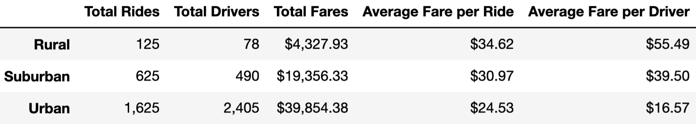

# PyBer Analysis
The analysis and visualization of ride-sharing data was performed using Python, Pandas and Matplotlib in this week's challenge.

## Resources 
**Software:** Python 3.9.5, **Jupyter Notebook:** 6.3.0

## Overview 
In this project PyBer ride-sharing data analysis was performed to study in depth the metrics of ridership and fare by the city in which the PyBer operates this was an exploratory analysis. This was done to enhance the ride-sharing through creating ride-share visualizations this is to improve the services provided and to figure out the affordability aimed at underserved neighborhoods.

## Results
In this challenge I have created a statistical overview shown below, this was done through the analysis and aggregation of the PyBer ride-sharing data.

After examining the summary we can conclude the following results:
- In urban cities the demand for ridership is higher compared to rural cities.
- The drivers in urban cities are four times more compared to rural cities.
- In suburban cities there are six times more drivers compared to rural cities with almost four and a half times more revenue.
- In rural cities we observe the highest average fare per ride and driver.
-  We can conclude that higher revenue is related to higher ration of drivers to rides.

## Summary (recommendations)
My recommendations to PyBer based on the analysis and results obtained is to increase the number of drivers especially in rural cities this will lead meeting the demand in these areas also it will lead to higher revenue in rural cities which now according to my results has the least revenue compared to urban and suburban cities. Also, according to the data the average fare per ride and average fare per drive is highest in rural cities this means that rides in rural cities are typically for long destinations this leads to decrease in revenue as other riders might have issues finding a ride, therefore adding more drivers might solve this issue faced in rural cities.
